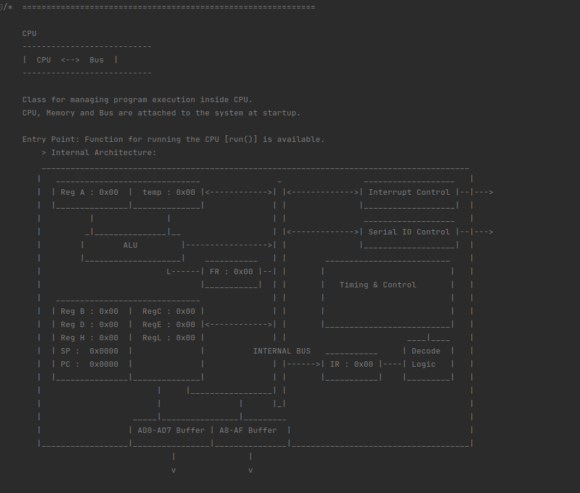
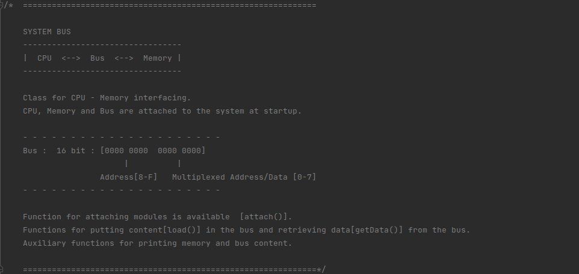
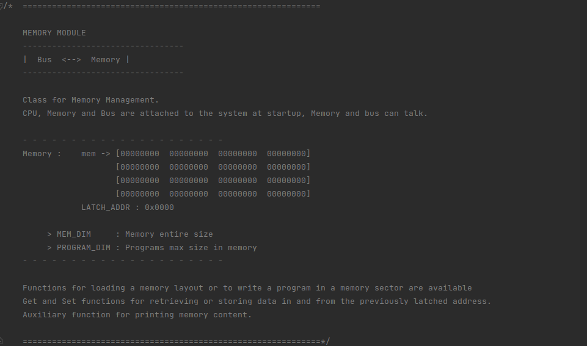

# Computer Architecture Simulator

Current Version : *0.3.0*

# Intel 8085 Processor

# Computer Architecture
### System Bus

### Main Memory (RAM)

# Intel 8085 Assembler
- Future versions...

# Basic Operating System (OS) running
- Future versions...

# Versioning
### Version 1.x.x Objectives
- Emulation properly working

### Version 0.4.0 Objectives
- Running properly

### Version 0.x.x Features
- Program Loading
- Stepping and running the CPU
- Attaching CPU and RAM to BUS
- Project cleanup and better setup
- 8085 Processor basic implementation
- Bus system implementation
- Basic GUI (empty)
- Project modular structure setup
- Memory unit implementation

### Future Objectives
- CPU stopping
- Basic OS boot
- Assembler
