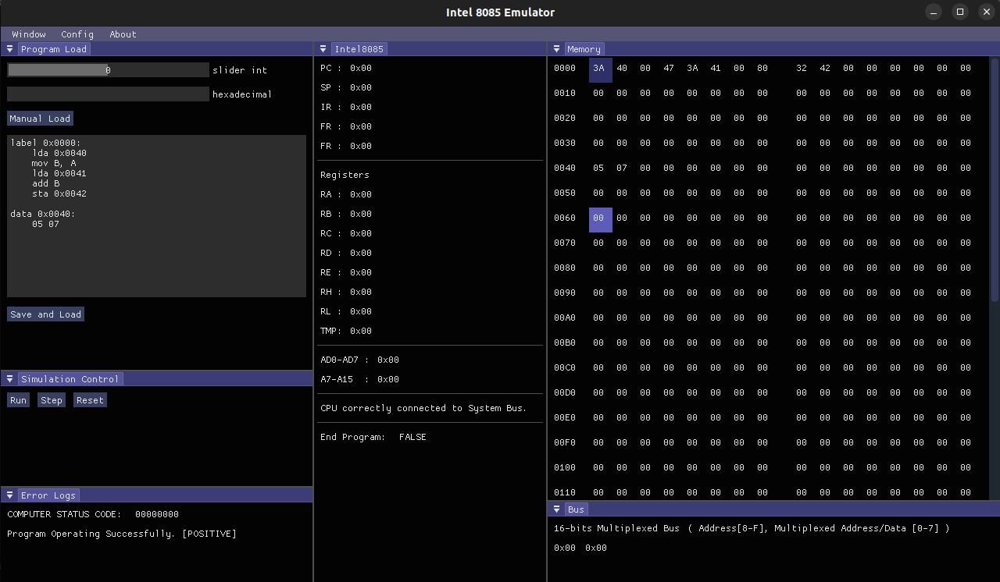

# Computer Architecture Simulator

Current Stable Version : **Version 2.0.0**

## License and Copyright
� 2022 Alberto Foti. All Rights Reserved.

## For Final Users
There isn't a proper installation procedure yet. (The product is still in development)

## Preview

# Intel 8085 Processor

# Computer Architecture
### System Bus

### Main Memory (RAM)

### Intel 8085 Assembler

# Basic Operating System (OS) running
- Future versions...

# Versioning
### Versions 2.x.x Objectives
- work in progress...

### Versions 1.x.x Features
- Example Programs
- Basic Assembler implementation

### Versions 0.x.x Features
- Manual Loading of a program binary (machine code)
- CPU stopping
- Running properly
- Program Loading
- Stepping and running the CPU
- Attaching CPU and RAM to BUS
- Project cleanup and better setup
- 8085 Processor basic implementation
- Bus system implementation
- Basic GUI (empty)
- Project modular structure setup
- Memory unit implementation

### Future Objectives
- Basic OS boot

## Libraries Used and other Dependencies
- vcpkg library manager  
- ImGui library (docking branch)
- Font list: Blender Pro, Roboto 

Font made from <a href="http://www.onlinewebfonts.com">oNline Web Fonts</a> is licensed by CC BY 3.0

